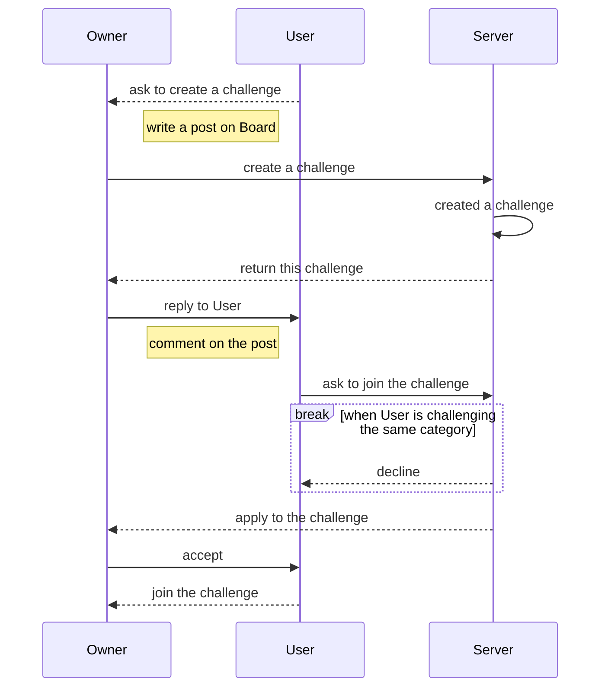

# ✨ Portfolio ✨

Content

1. [TAEWON-KIM.json](#1-taewon-kimjson-😄)
1. [Tech skills](#2-tech-skills-🌱)
1. [Projects](#3-projects-🔭)
1. [How to Collaborate](#4-how-to-collaborate-👯)
1. [Reviews](#5-reviews-💬)
1. [Contact me](#6-contact-me-📫)

## 1. TAEWON-KIM.json 😄

<!--  -->
<!--  -->

```json
{
  "email": "dankim0213@gmail.com",
  "name": "Taewon Kim",
  "alias": "Dan Kim",
  "birth": "1995-02-13",
  "job": ["Frontend Developer", "Tech Blogger"],
  "who-am-i": [
    "Hi, there 👋 ",
    "I am a frontend developer",
    "who belinves in one line of code rather than one thousand words",
    "who likes to talk about why not",
  ]
}
```

## 2. Tech skills 🌱

### 나의 기술 스킬

- React: ⭐️⭐⭐⭐,
- JavaScript: ⭐️⭐⭐⭐,
- TypeScript: ️⭐⭐⭐,
- HTML: ⭐️⭐⭐⭐,
- CSS: ️⭐⭐⭐,
- Git: ⭐️⭐⭐⭐,
- Jira: ⭐⭐,
- Testing: ⭐⭐,
- Java: ⭐⭐⭐,
- Python: ⭐⭐,

### 기준

- 별 5개: 최신 기술에 숙달하며 구글링이 필요없는 단계
- 별 4개: 내가 쓰는 기술이 무엇인지 정확히 인지하는 단계
- 별 3개: 어떤 기술을 써야할지 알지만 숙달되지 못한 단계
- 별 2개: 이 스킬에는 어떤 기술이 있는지 존재만 아는 단계
- 별 1개: 아는 척도 할 수 없는 아장아장 단계

## 3. Projects 🔭

### TooNBTI

[웹툰 취향 분석 서비스](https://github.com/DanKim0213/TooNBTI)

- graphql을 백엔드와 프론트엔드에 도입 및 graphql-codegen을 활용하여 설정
- Intersection Observer를 활용하여 무한 스크롤 기능을 웹툰 목록 페이지에 적용
- 취향 테스트 페이지에서 연관 웹툰 아이템을 불러올때, 중복된 웹툰을 Map 자료형을 사용하여 거르기
- TypeScript를 프론트엔드에 적용하여 컴포넌트별 propstype 및 graphql API에서 빠른 디버깅과 협업에 안정성을 추구
- Github flow를 도입하여 팀 프로젝트 코드관리를 도맡아 진행

### 66 days

개발자로서 가져야할 습관 세우기 서비스

- 팀장으로서 프로젝트 관리
- Intersection Observer를 활용하여 무한 스크롤 기능을 그룹 검색 페이지에 적용
- Github flow를 도입하여 팀 프로젝트 코드관리를 도맡아 진행
- 프로젝트에 대한 흐름도 & 팀 간 소통을 위한 Notion 문서화 담당
- 그룹 소개 페이지를 퍼블리싱
- 카카오 소셜 로그인 담당
- 프론트엔드 개발자들의 코드 리뷰를 진행

### Auctopus

[실시간 소통 중고거래 서비스](https://github.com/DanKim0213/Auctopus)

- Web Socket을 활용하여 채팅 구현
- 카카오 계정을 활용하여 소셜 로그인 구현
- TypeScript를 프로젝트에 적극 도입하길 추천했고 팀원들과 스터디 주도
- Git으로 프로젝트 관리 담당

## 4. How to Collaborate 👯

### 그라운드 룰

- 모든 아이디어는 솔직하게 말하기
- 질문은 시도한 문제 접근 방법과 함께 준비해서 하기
- 회의는 상호존중하며 경청하기

### 문제 접근 방식



## 5. Reviews 💬

<details>
  <summary>SSAFY</summary>

> "태원님은 웹 프로젝트 경험이 없던 저와 페어를 하면서 모르는 부분을 물어보았을 때 친절히 알려주었습니다. 그리고 결정사항에 대해 깊게 고민하는 경향이 있어 힘들어하는 모습을 보이지만, 그 덕분에 프로젝트를 하면서 많은 대화를 했고, 그 결과 문제가 생기더라도 금방 해결할 수 있었던것 같습니다."
> by 여민지, 1학기 싸피 페어

> "태원님은 지금까지 쌓은 경험을 통해 다른 사람들을 이끌어주시곤 했고, 저 또한 처음 사용해보는 리액트에 대해 많이 도움을 많이 받았습니다. 프로젝트 진행 시 커밋을 작은 기능 단위로 자주 하면서 코드 리뷰를 해주시기도 했습니다. 덕분에 아직 익숙하지 않았던 제 코드가 좀 더 나은 방향으로 갈 수 있었던 것 같습니다. 또 팀장이자 프론트엔드 리더로서 나아가야할 방향성을 잘 잡아주셨고, GraphQL 도입을 먼저 제안하며 학습해오셔서 기틀을 잡아 다른 팀원들에게 전파하여 팀원으로서 또 하나의 경험을 얻을 수 있었습니다. 같이 프로젝트를 진행하면서 저도 다른 사람들에게 많이 나누는 사람이 되어야겠다는 생각이 들었습니다. :slightly_smiling_face:"
> by 윤지영, 1학기 싸피 페어 & 2학기 특화 프로젝트

> "FE Tech Leader로서 프론트를 전반적으로 이끌어줘서 멋진 프로젝트가 나올 수 있었다고 생각합니다. 또한 책임감이 강하고 문제해결능력이 뛰어나며 특히 FE 관련 이슈뿐만 아니라 Git, BE까지 신경써줘서 완성도 있는 프로젝트가 나왔습니다."
> by [이지원](https://github.com/jiwon1027), 2학기 공통 프로젝트

> "자신의 워라밸이 명확하지만 주어진 일은 책임감을 가지고 해내는 팀원입니다. 프론트엔드 개발자로 알고 기술이 다른 팀원들보다 많아 다른 팀원들에게 도움을 주는 든든한 동료입니다. 팀원들과 코드 리뷰에 있어 사용한 이유를 중시하며 더 좋은 코드를 개발하려 합니다. 기술을 선택과 자신의 코드에 자부심을 가지고 있어 의견을 좁히는데 간혹 시간이 걸립니다."
> by [권성은](https://github.com/hellowco), 2학기 특화 & 자율 프로젝트

> "팀장이란 자리가 부담스럽기도 하고 힘든 자리이셨을텐데 끝까지 모든 팀원들을 포기하지 않고 이끌고 나가주셔서 감사했습니다. 저 같은 경우는 타입스크립트를 처음 써보는 입장이었는데, 제 상황을 모두 고려해주시고 꼼꼼하게 코드 리뷰를 해주시며 기술적인 어려움이 있으면 적극적으로 가르쳐주셔서 같은 프론트엔드 개발 팀원으로서 많이 의지가 되고 든든했습니다. 덕분에 많이 배우고 저 스스로도 성장할 수 있는 프로젝트가 되었습니다 :slightly_smiling_face:"
> by [성다연](https://github.com/dysung32), 2학기 자율 프로젝트

> "태원님은 기분에 따라 task를 옮겨다니는 단점이 있지만 긍정적인 성격을 가지셨습니다. 회의 시에 자신의 의견도 표출하면서 다른 사람의 의견도 경청할 줄 알고 팀원들이 프로젝트에 대한 동력을 잃지 않게 독려한다"
> by [김진호](https://github.com/No88888888), 2학기 특화 & 자율 프로젝트

> "꼼꼼하고 체계적입니다(ex. 깃 브랜치 / 시연시나리오?) 그리고 의견을 적극적으로 제시합니다 (ex. 주제 타겟층 명확히 / 프로젝트 시작 전 어떤 기술을 쓸건지?). 가장 인상깊었던 것은 '누군가는 해야할 일이라서 내가 하는 것' 이라고 말씀한 것이었습니다. 프로젝트하면서 기능 구현 관련해서 같이 한거는 없어서 잘은 모르겠지만, 그래도 그외의 것들을 많이 배울 수 있었습니다."
> by 변유정, 2학기 공통 프로젝트

</details>

## 6. Contact me 📫

이메일 `dankim0213@gmail.com`로 편안히 연락주세요

<!-- ### Hi there 👋 -->

<!--
**DanKim0213/DanKim0213** is a ✨ _special_ ✨ repository because its `README.md` (this file) appears on your GitHub profile.

Here are some ideas to get you started:

- 🔭 I’m currently working on ...
- 🌱 I’m currently learning ...
- 👯 I’m looking to collaborate on ...
- 🤔 I’m looking for help with ...
- 💬 Ask me about ...
- 📫 How to reach me: ...
- 😄 Pronouns: ...
- ⚡ Fun fact: ...
-->
